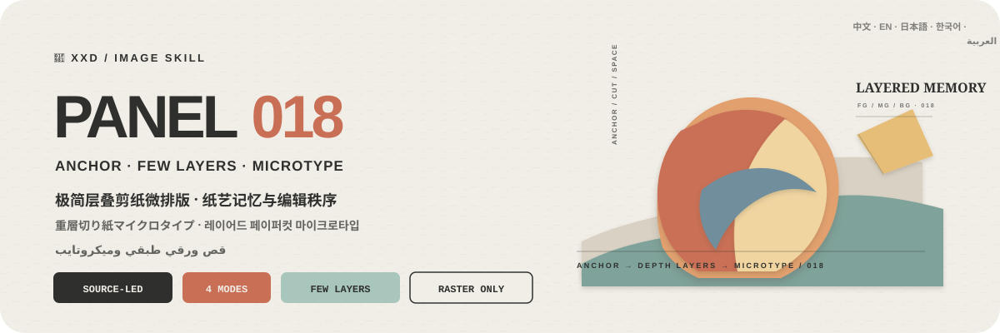
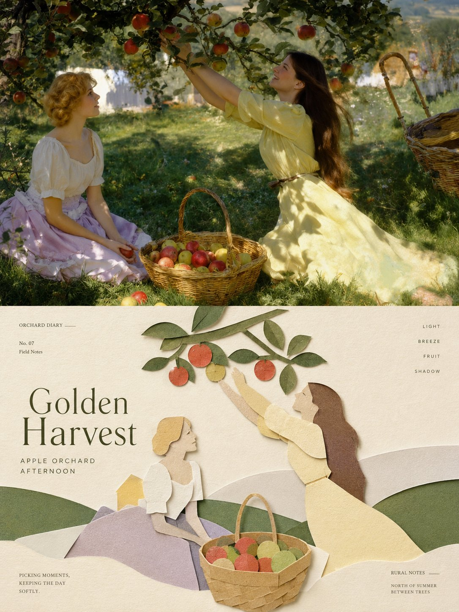
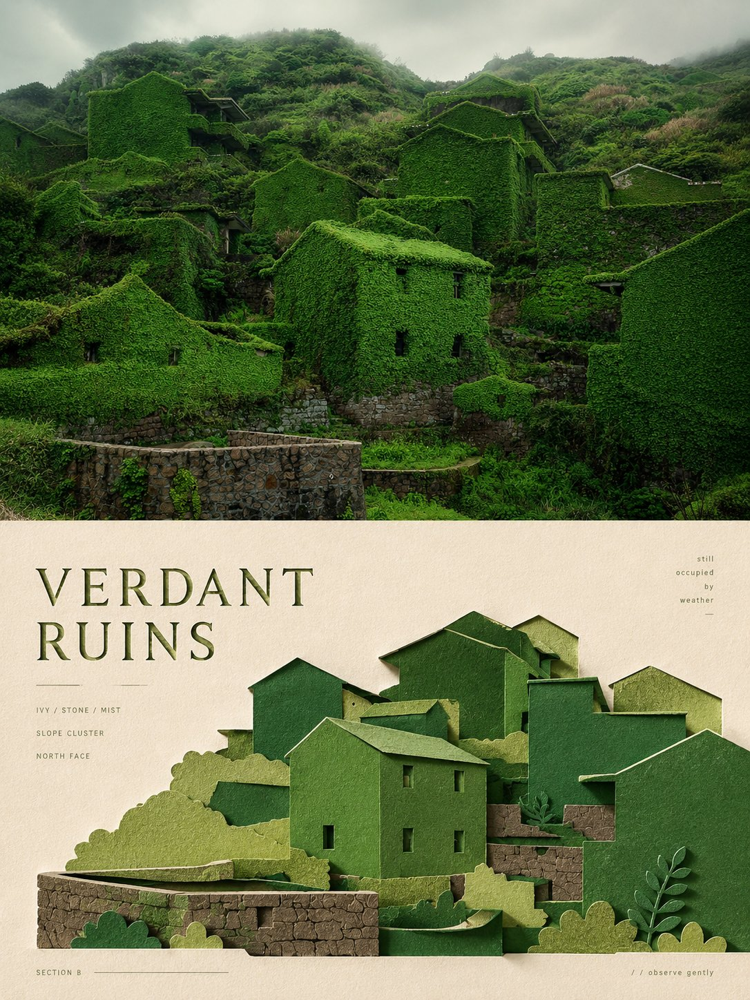

<p align="center">
  
</p>

<div align="center">

# 🦁 XXD Panel 018

### 一つの視覚アンカー、少数の紙層、精密なマイクロタイプで写真を再構成

[](./SKILL.md)
[](#4つの出力を支えるひとつの重層切り紙ロジック)
[](#境界と信頼性)

<a href="README.md">简体中文</a> · <a href="README.en.md">English</a> · <strong>日本語</strong> · <a href="README.ko.md">한국어</a> · <a href="README.ar.md">العربية</a>

</div>

> 一つの視覚アンカー · 少数の前中後層 · 象牙色の余白 · マット紙 · 完全なマイクロタイプ

XXD Panel 018 は、Codex と互換 Agent のための画像生成 Skill です。一つの主体または不可分な関係を視覚アンカーに選び、元写真固有の手掛かりを最低3つ保ち、必要な環境関係だけを前景・中景・背景の少数紙層へ変換します。

尺度差、軸、正負形、前後の遮蔽、広い暖象牙色の余白で階層を作ります。色は主色・暗い構造色・明るい層色・ごく小さなアクセントへ整理し、マットな繊維、明確な切り口、厚み、柔らかな接触影で紙層を成立させます。短いタイトル一つと2〜4組の微小文字が読解経路を作ります。

## なぜ 018 が必要なのか

一般的な「折り紙風」は、ローポリ CG、子どもの工作、プラスチック 3D、均等対称、またはどの写真にも付けられる紙鶴や紙花へ崩れがちです。

018 は順序を逆にします。

```text
3つの固有手掛かりと中心関係を固定 → 視覚アンカーを一つ選ぶ → 必要な環境関係だけを前景／中景／背景層へ変換 → 折り／切り／遮蔽／尺度／軸／正負形で階層化 → 主色／暗い構造色／明るい層色／微小アクセントを割り当てる → 象牙色の余白を保つ → 一つの題＋2〜4組の微小文字で読解経路を作る
```

無関係な写真に替えても視覚アンカー、前中後層の関係、負の余白、色の役割、文字経路がほぼ成立するなら、それは 018 ではありません。

## 018 のビジュアル契約

- **一つの視覚アンカー：** 少なくとも3つの固有手掛かりと中心動作を保ち、主体を複製しません。
- **少数の前中後層：** 必要な環境関係だけを紙層へ変え、各層が深度、尺度、方向、遮蔽または物語を担います。
- **明確な編集階層：** 尺度、軸、正負形、前後遮蔽、広い象牙色の余白が一つの焦点を作ります。
- **抑制した折りと切り：** 折りは関節、面転換、方向、深度を説明し、接触影は積層だけを示します。
- **元写真由来の色役割：** 主色、暗い構造色、明るい層色、ごく小さなアクセント。
- **本物のマット紙：** 繊維、切り口の厚み、柔らかな接触影。独立した多面彫刻やプラスチックではありません。
- **完全な微小組版：** 一つの短い題と2〜4組の小文字が紙辺、輪郭、軸、余白に読解経路を作り、自動文案は年を使いません。

## 作例 · X より

> [小小東（@xiaoxiaodong01）](https://x.com/xiaoxiaodong01/status/2090140034926350693) · 2026-08-19<br>
> GPT2 x 剪纸 x 手工 x 美学提示词 x VOL.018

<table>
  <tr>
    <td width="50%"><a href="https://x.com/xiaoxiaodong01/status/2090140034926350693"></a></td>
    <td width="50%"><a href="https://x.com/xiaoxiaodong01/status/2090140034926350693"></a></td>
  </tr>
  <tr>
    <td width="50%"><a href="https://x.com/xiaoxiaodong01/status/2090140034926350693"></a></td>
    <td width="50%"><a href="https://x.com/xiaoxiaodong01/status/2090140034926350693"></a></td>
  </tr>
</table>

<p align="center"><a href="https://x.com/xiaoxiaodong01/status/2090140034926350693">元の投稿と完全なプロンプトを見る →</a></p>

これらの作例は 018 の美的意図を示すものであり、作例の被写体、構図、配色、コピー、旧キャンバス比率が生成時の参照や現在の既定値になることはありません。

## 組み合わせ可能な4つの出力

`1`、`1+3`、`1,2,4`、`全部` で一つまたは複数を選べます。`全部` は元画像ごとに7点の独立PNGを出力します。モード選択後、生成前に完成画像全体の画角を必ず確認します：元プロンプトの `3:4`、明示的な元画像比率、一般的な比率、またはカスタム比率／正確なピクセルです。元画像寸法を暗黙には適用しません。

| モード | 画角ルール | 成果物 |
| --- | --- | --- |
| `top-bottom` | ユーザー確認済みの完成画角 | 完成キャンバスを一度に生成：上に高忠実度の元画像、下に 018 デザイン、約50/50 |
| `left-right` | ユーザー確認済みの完成画角 | 完成キャンバスを一度に生成：左に高忠実度の元画像、右に 018 デザイン、約50/50 |
| `design-only` | ユーザー確認済みの完成画角 | 018 デザインが全画面を満たし、元画像は表示しない |
| `wallpaper-pack` | 端末ごとに確認 | スマートフォン、iPad、デスクトップ、子ども用ウォッチの個別PNG |

二連モードは元画像を高忠実度の編集／参照入力として使い、完全なスタイルプロンプト一式で完成画面を直接生成します。写真、デザイン、色、光、文字、意味を一体化するためです。決定論的な合成は、完成画面の再試行後も失敗した場合、原画像のピクセル完全保持を明示された場合、生成経路が指定画角に対応しない場合、または無劣化の最終ピクセル調整が必要な場合だけ使います。

壁紙は連動または独立を選べます。連動はiPad基準作を一つ承認し、他の端末を元画像＋同じ基準作から個別に再構成します。独立は各端末が元画像だけを参照します。どちらも他端末の成果を切り抜かず、派生を連鎖しません。

## 紙が視覚記憶を、微小文字が編集秩序を担う

生成前に、自動文案、カスタム文案、文字なしを選びます。文字を入れる場合は対象言語または地域も指定します。

自動文案は、主体、既知の場所、動き、素材、感情、関係、根拠ある象徴から短い題を一つ作り、2〜4組のごく小さな補助文字を加えます。

自動文案は年を作らず、使いません。正確なユーザー文は年を含んでも一字一句保ちます。主題は識別と感情を、小文字は秩序、リズム、分類、精密さを担い、紙辺、輪郭、軸、層、余白に読解経路を作ります。

ユーザーが完成稿を渡した場合は一字一句保ちます。方向や編集可能な草稿の場合だけ、対象、目的、必須語、語調、含意を守りながら磨きます。

言語は命令文ではなく、想定する読者に従います。

```text
対象市場・読者 > 指定された成果物言語 > 方向指示の言語；不明なら生成前に確認
```

日本版は自然な現代日本語、韓国向けは自然な韓国語と正しい分かち書き、英国版は英国英語、アラビア語版は原則として自然な現代標準アラビア語と正しい右から左の組版を使います。外見、服装、風景、看板から国籍を推測せず、雰囲気づくりの偽外国語も使いません。

## 完成キャンバス優先とラスター境界

画像モデルが完成画面全体の美的再構成を担当し、二連レイアウトも完成キャンバス一枚の直接生成を既定とします。`scripts/compose_panel.py` は条件付きの復旧、無劣化ピクセル調整、読み取り専用監査にだけ残し、毎回の事前計画や美的評価には使いません。

納品物はすべてPNGラスターで、呼び出しごとに `~/Desktop/xxd/` に新規タスクを作ります。設定済み画像経路は匿名化された状態だけを返し、提供元、接続先、認証情報、ヘッダー、プロンプト、応答、アカウント情報を公開しません。SVG、HTML、Canvas、図解、プログラム描画は最終作品の代替になりません。

## 画像モデルの優先順位

GPT Image 2 を既定の第一候補とします。高忠実度の参照画像、生成前の完成キャンバス確認、二連モードの完成画面一括生成、条件を満たした場合だけのスクリプト合成という既存の流れは変わりません。

現在のツールまたは設定済み経路から実際に利用でき、元画像の忠実度、完成画角、対象言語の文字、連動壁紙の複数参照を満たせる場合は、Seedance 5.0 Pro、Nano Banana Pro（Gemini Image Pro）、Nano Banana 2（Gemini Image Flash）、その他の互換ビットマップモデルも利用できます。代替モデルが変更できるのは生成経路だけで、モード、画角、文案、言語、壁紙関係、完成キャンバス優先の方針は変更できません。

適切な経路がない場合は、画像生成ツールを有効にするか API Key を提供するようユーザーに案内します。ユーザーが提供した認証情報は現在のタスクで利用できますが、返信やログに再表示・記録・開示しません。明示的な依頼がない限り、長期保存やプロバイダー、アカウント、課金、グローバル経路の設定変更も行いません。

## 使い始める

```bash
git clone https://github.com/nevertoday/xxd-panel-018.git
mkdir -p ~/.codex/skills
ln -s "$(pwd)/xxd-panel-018" ~/.codex/skills/xxd-panel-018
```

Claude Code では同じフォルダを `~/.claude/skills/xxd-panel-018` にリンクできます。インストール後に Agent セッションを再起動してください。

```text
$xxd-panel-018
この写真を左右二連にしてください。文案は写真の意味から作り、自然な韓国語を使ってください。
```

写真だけでも呼び出せます。番号付きの複数行メニューでモードと文字設定を確認し、壁紙では連動／独立と端末サイズも確認します。

詳細仕様：

- [Skill ワークフロー](SKILL.md)
- [中国語の完全プロンプト](references/xxd-panel-018-prompt.zh-CN.md)
- [英語の完全プロンプト](references/xxd-panel-018-prompt.en.md)
- [元のスタイル指示](references/018-source.md)

## 境界と信頼性

- 各写真は独立したタスク内だけで使い、他の入力、旧成果物、作例の主題、色、文案、構図を借りません。
- 呼び出すたびに新しいタスクフォルダを作り、同じ原画像と条件でも新たに生成します。
- 成果物は PNG ビットマップであり、SVG、HTML、Canvas、プログラム描画の代替物ではありません。
- 設定済みビットマップブリッジは匿名化した状態だけを返し、プロバイダー、エンドポイント、ヘッダー、認証情報、プロンプト、応答本文を表示しません。
- 選択した通常モードごとに1点を返し、`wallpaper-pack` を選ぶと独立壁紙4点を追加します。`全部` は元写真1枚につき7点を4つの同階層モードフォルダへ出力し、一覧コラージュにはまとめません。

ローカル合成には Python 3 と Pillow が必要です。安全なビットマップブリッジは Python 3.11+ の `tomllib` を使用します。画像生成には、ホスト Agent の内蔵ラスター生成機能または設定済みの互換ルートが必要です。

## リポジトリ

```text
xxd-panel-018/
├── SKILL.md
├── README.md / README.en.md / README.ja.md / README.ko.md / README.ar.md
├── agents/openai.yaml
├── assets/banner.svg + examples/（今後のローカル作例用）
├── scripts/compose_panel.py + configured_imagegen.py
└── references/xxd-panel-018-prompt.zh-CN.md + xxd-panel-018-prompt.en.md + 018-source.md
```

## XXD について

XXD は小小東（Xiaoxiaodong）のブランド名の略称です。このプロジェクトは [@xiaoxiaodong01](https://x.com/xiaoxiaodong01) が制作・管理しています。

## サポートと会員制度

### 個別深度相談 · 1時間 CNY 299

Skills 利用に関する一対一相談は1時間 CNY 299です。下の WeChat QR コードから予約してください。

### Xiaoxiaodong Skills ユーザー交流グループ · CNY 99

一度 CNY 99 を支払うと、ワークフロー共有、作品相談、ユーザー同士の支援を行う交流グループに参加できます。時間制の個別相談は含まれません。

### 知識星球＋会員プロンプトライブラリ · 年額 CNY 699

[知識星球](https://wx.zsxq.com/group/15554814142882)と[XXD 会員プロンプトライブラリ](https://vip.xiaoxiaodong.ai/)は同じ会員権です。**一度の年額決済で両方を利用でき、二重の購入は不要です。**

1. 知識星球で加入後、WeChat でプロンプトライブラリの交換コードを受け取る。
2. プロンプトライブラリで加入後、WeChat で知識星球への招待を受け取る。

<p align="center">
  <a href="https://xiaoxiaodong.pages.dev/assets/wechat-qr.png"></a>
</p>

<div align="center">

**少数の紙層が視覚記憶を残し、微小文字がそれを収蔵できる秩序へ整える。**

</div>

---

<div align="center">
  <h2>☕ オープンソースプロジェクトを支援</h2>
  <p>このプロジェクトが時間の節約になったなら、Star、共有、コーヒー一杯で継続を支援できます。</p>
  <table><tr><td align="center" width="240">
    <a href="https://github.com/nevertoday/zhongguo-traditional-colors/blob/main/docs/images/buy-me-a-coffee-qr.png?raw=true"></a><br>
    <strong>Buy me a coffee</strong><br><sub>QR コードを読み取るか開いて支援できます</sub>
  </td></tr></table>
  <p><sub>支援は任意であり、このオープンソースプロジェクトの利用権には影響しません。</sub></p>
</div>
